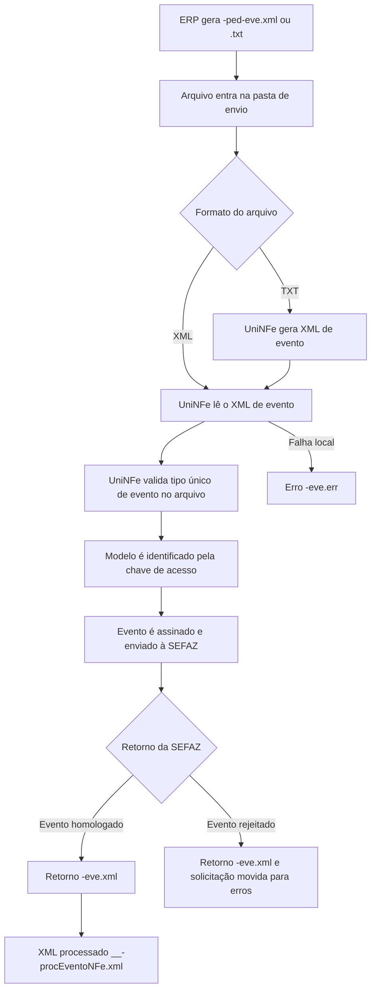

# Eventos de NFe e NFCe por arquivo

O serviço de eventos permite que o ERP envie eventos vinculados a uma NFe ou NFCe, como cancelamento, carta de correção, EPEC, manifestação do destinatário, comprovante de entrega e conciliação financeira.

O UniNFe processa os eventos por arquivo XML ou TXT gravado na pasta de envio da empresa. O modelo do documento é identificado pela chave de acesso informada no evento:

- chave com modelo `55`: NFe;
- chave com modelo `65`: NFCe.

## Quando usar

Use este serviço quando o ERP precisar registrar um evento fiscal relacionado a uma NFe ou NFCe, por exemplo:

- cancelamento de NFe;
- cancelamento por substituição de NFCe;
- carta de correção eletrônica;
- EPEC;
- manifestação do destinatário;
- comprovante de entrega e cancelamento do comprovante de entrega;
- conciliação financeira e cancelamento da conciliação financeira;
- eventos de prorrogação de ICMS e seus cancelamentos;
- outros eventos aceitos pelo leiaute de eventos de NFe/NFCe.

Todos os eventos dentro do mesmo arquivo devem ser do mesmo tipo. Se precisar enviar eventos de tipos diferentes, gere arquivos separados.

## Pré-requisitos

Antes de enviar o evento, confira na configuração da empresa:

- a empresa está cadastrada no UniNFe;
- a pasta de envio e a pasta de retorno estão configuradas;
- a pasta de XMLs enviados está configurada;
- o certificado digital está configurado e válido;
- o ambiente da empresa corresponde ao ambiente do documento;
- as configurações de proxy estão preenchidas, se a rede exigir proxy para acesso à internet.

## Arquivo XML de envio

Para enviar por XML, o ERP deve gerar o arquivo na pasta de envio da empresa com o final fixo:

```text
<identificador>-ped-eve.xml
```

Exemplos:

```text
cce35111253420477000192550550000033071213028272_01-ped-eve.xml
canc1101103511031029073900013955001000000001105112804101-ped-eve.xml
epec-nfce-35150309062049000143650010000000604010373539110140-01-ped-eve.xml
```

Estrutura simplificada de uma carta de correção:

```xml
<?xml version="1.0" encoding="utf-8"?>
<envEvento versao="1.00" xmlns="http://www.portalfiscal.inf.br/nfe">
  <idLote>000000000038313</idLote>
  <evento versao="1.00" xmlns="http://www.portalfiscal.inf.br/nfe">
    <infEvento Id="ID1101103511125342047700019255055000003307121302827201">
      <cOrgao>35</cOrgao>
      <tpAmb>2</tpAmb>
      <CNPJ>53420477000192</CNPJ>
      <chNFe>35111253420477000192550550000033071213028272</chNFe>
      <dhEvento>2011-12-20T16:55:00-02:00</dhEvento>
      <tpEvento>110110</tpEvento>
      <nSeqEvento>1</nSeqEvento>
      <verEvento>1.00</verEvento>
      <detEvento versao="1.00">
        <descEvento>Carta de Correcao</descEvento>
        <xCorrecao>Teste de correcao da nota fiscal eletronica</xCorrecao>
        <xCondUso>A Carta de Correcao e disciplinada pelo paragrafo 1o-A do art. 7o do Convenio S/N.</xCondUso>
      </detEvento>
    </infEvento>
  </evento>
</envEvento>
```

## Arquivo TXT de envio

Para enviar por TXT, o ERP deve gerar o arquivo na pasta de envio da empresa com o final fixo:

```text
<identificador>-ped-eve.txt
```

Exemplo:

```text
cce35111253420477000192550550000033071213028272_01_03-ped-eve.txt
```

O conteúdo deve informar os campos no formato `campo|valor`. Para eventos com mais de uma ocorrência, use `evento|1`, `evento|2` e assim por diante.

```text
idLote|000000000038313
evento|1
Id|ID1101103511125342047700019255055000003307121302827201
cOrgao|35
tpAmb|2
CNPJ|53420477000192
chNFe|35111253420477000192550550000033071213028272
dhEvento|2011-12-20T16:55:00-02:00
tpEvento|110110
nSeqEvento|1
verEvento|1.00
descEvento|Carta de Correcao
xCorrecao|Correcao do texto da nota fiscal
xCondUso|A Carta de Correcao e disciplinada pelo paragrafo 1o-A do art. 7o do Convenio S/N.
```

Ao receber o TXT, o UniNFe gera o XML correspondente para processamento. Depois do processamento, o arquivo de solicitação é removido.

## Campos principais

| Campo | Como preencher |
|---|---|
| `idLote` | Identificador do lote de eventos. |
| `evento` | Número sequencial do evento dentro do arquivo TXT. Use quando o TXT tiver uma ou mais ocorrências de evento. |
| `Id` | Identificador do evento. Quando não informado no TXT, o UniNFe monta o identificador a partir do tipo do evento, chave e sequência. |
| `cOrgao` | Código do órgão que receberá o evento. Quando não informado no TXT, o UniNFe usa a UF da chave de acesso. |
| `tpAmb` | Ambiente do evento. Use `1` para produção ou `2` para homologação. Quando não informado no TXT, o UniNFe usa o ambiente configurado na empresa. |
| `CNPJ` ou `CPF` | Documento do autor do evento. |
| `chNFe` | Chave de acesso da NFe ou NFCe vinculada ao evento. |
| `dhEvento` | Data e hora do evento no formato aceito pelo leiaute fiscal, com fuso horário quando aplicável. |
| `tpEvento` | Código do tipo de evento. |
| `nSeqEvento` | Número sequencial do evento para a chave. Quando aplicável e não informado no TXT, o UniNFe usa `1`. |
| `verEvento` | Versão do leiaute do evento. Quando não informado no TXT, o UniNFe usa `1.00`. |
| `descEvento` | Descrição do evento. Quando não informada no TXT, o UniNFe preenche a descrição correspondente ao tipo do evento, quando conhecida. |

## Tipos de evento comuns

| Código | Evento |
|---|---|
| `110110` | Carta de correção eletrônica. |
| `110111` | Cancelamento de NFe. |
| `110112` | Cancelamento por substituição de NFCe. |
| `110130` | Comprovante de entrega da NFe. |
| `110140` | EPEC. |
| `110750` | Conciliação financeira da NFe. |
| `110751` | Cancelamento da conciliação financeira da NFe. |
| `210200` | Confirmação da operação. |
| `210210` | Ciência da operação. |
| `210220` | Desconhecimento da operação. |
| `210240` | Operação não realizada. |
| `111500` e `111501` | Pedido de prorrogação de ICMS. |

Cada tipo de evento possui campos específicos no grupo de detalhes. O ERP deve gerar os campos exigidos pelo leiaute fiscal do evento que será transmitido.

## Fluxo de processamento

1. O ERP grava o arquivo `-ped-eve.xml` ou `-ped-eve.txt` na pasta de envio.
2. O UniNFe identifica o pedido de eventos.
3. Se o arquivo for TXT, o UniNFe gera o XML de envio de evento.
4. O UniNFe valida se todos os eventos do arquivo são do mesmo tipo.
5. O UniNFe identifica se o evento é de NFe ou NFCe pela chave de acesso.
6. O evento é assinado e enviado ao webservice da SEFAZ.
7. O retorno da SEFAZ é gravado na pasta de retorno com o final `-eve.xml`.
8. Quando o evento é homologado, o UniNFe gera o XML processado do evento com o final `-procEventoNFe.xml`.
9. Se o evento não for homologado, o XML de solicitação é movido para a pasta de erros.
10. Se ocorrer falha local antes ou durante o envio, o UniNFe grava um arquivo `-eve.err` na pasta de retorno.

## Fluxograma



## Arquivos gerados e movimentados

| Momento | Pasta | Nome do arquivo | Quando aparece |
|---|---|---|---|
| Pedido XML | Pasta de envio | `<identificador>-ped-eve.xml` | Arquivo criado pelo ERP para enviar evento por XML. |
| Pedido TXT | Pasta de envio | `<identificador>-ped-eve.txt` | Arquivo criado pelo ERP para enviar evento por TXT. |
| XML gerado a partir do TXT | Pasta de envio ou pasta de validação, conforme origem do arquivo | `<identificador>-ped-eve.xml` | Criado quando o ERP envia o pedido em TXT. |
| Retorno ao ERP | Pasta de retorno | `<identificador>-eve.xml` | Retorno XML recebido da SEFAZ para o lote de eventos. |
| Erro ao ERP | Pasta de retorno | `<identificador>-eve.err` | Erro local antes ou durante o processamento, como falha de leitura, validação, certificado, assinatura, comunicação ou gravação. |
| XML processado do evento | Pasta de XMLs enviados, conforme configuração de eventos | `<chave>_<tipoEvento>_<sequencia>-procEventoNFe.xml` | Criado quando o evento é homologado pela SEFAZ. |
| Pedido rejeitado ou não homologado | Pasta de erros | Nome original do arquivo de solicitação | Movido quando o retorno não autoriza o evento. |

## Como tratar o retorno

O ERP deve monitorar a pasta de retorno e aguardar um destes arquivos:

```text
<identificador>-eve.xml
<identificador>-eve.err
```

O retorno XML contém o resultado do lote e o resultado de cada evento. Quando o lote é processado e o evento retorna como homologado, o UniNFe gera o XML processado do evento. Os status de homologação tratados pelo UniNFe incluem evento registrado e vinculado ao documento, evento registrado sem vinculação e evento cancelado homologado quando aplicável.

Quando o retorno XML indicar rejeição, o ERP deve exibir o motivo ao usuário e permitir a correção do evento. Quando o retorno for `.err`, o problema ocorreu localmente antes de obter um retorno normal da SEFAZ; depois de corrigir a causa, gere novamente o arquivo `-ped-eve.xml` ou `-ped-eve.txt`.

## Nomenclaturas antigas

O UniNFe ainda reconhece, por compatibilidade, algumas nomenclaturas antigas para tipos específicos de evento:

| Uso | Envio antigo | Retorno antigo | Erro antigo |
|---|---|---|---|
| Cancelamento | `-env-canc.xml` ou `-env-canc.txt` | `-ret-env-canc.xml` | `-ret-env-canc.err` |
| Carta de correção | `-env-cce.xml` ou `-env-cce.txt` | `-ret-env-cce.xml` | `-ret-env-cce.err` |
| Manifestação | `-env-manif.xml` ou `-env-manif.txt` | `-ret-env-manif.xml` | `-ret-env-manif.err` |

Para novas integrações, use a nomenclatura unificada `-ped-eve.xml` ou `-ped-eve.txt`.

## Erros comuns

As causas mais comuns de erro ou rejeição são:

- arquivo sem a tag `envEvento` ou com estrutura diferente do leiaute esperado;
- mistura de tipos de evento no mesmo arquivo;
- chave de acesso ausente, incompleta ou inválida;
- ambiente incompatível com o documento;
- CNPJ ou CPF do autor incorreto;
- sequência do evento inválida;
- campos específicos do evento ausentes, como justificativa de cancelamento, protocolo, correção ou dados de EPEC;
- certificado digital ausente, vencido ou inacessível;
- proxy ou conexão TLS configurados incorretamente;
- falha de comunicação com o webservice;
- falta de permissão de leitura e gravação nas pastas configuradas.

## Cuidados para o integrador

- Use sempre `-ped-eve.xml` ou `-ped-eve.txt` como final do arquivo de envio em novas integrações.
- Envie apenas um tipo de evento por arquivo.
- Use uma chave de modelo `55` para eventos de NFe e de modelo `65` para eventos de NFCe.
- Preencha os campos específicos exigidos pelo tipo de evento.
- Aguarde o arquivo `-eve.xml` para interpretar a resposta da SEFAZ.
- Preserve o arquivo `-procEventoNFe.xml` quando o evento for homologado, pois ele contém o evento enviado junto com o retorno da SEFAZ.
- Em erros `.err`, corrija a causa local antes de reenviar o evento.
