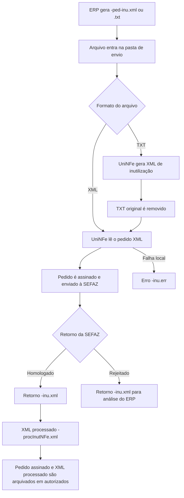

# Inutilização de numeração de NFe e NFCe

A inutilização de numeração permite comunicar à SEFAZ que uma faixa de números de NFe ou NFCe não será utilizada. Use este serviço quando houver quebra de sequência numérica e os números não puderem mais ser emitidos, por exemplo por falha no ERP, erro operacional ou salto na numeração.

O UniNFe processa a inutilização por arquivo XML ou TXT gravado na pasta de envio da empresa. O modelo informado no pedido define se a operação será enviada como NFe ou NFCe:

- `mod` igual a `55`: NFe.
- `mod` igual a `65`: NFCe.

## Quando usar

Use este serviço quando:

- uma sequência de numeração foi pulada e não será usada;
- a empresa precisa regularizar números não emitidos perante a SEFAZ;
- o ERP precisa registrar a inutilização de um número único ou de uma faixa de números;
- o suporte precisa reenviar uma inutilização depois de corrigir um erro local de arquivo, certificado, comunicação ou configuração.

Não use este serviço para cancelar uma NFe ou NFCe já autorizada. Cancelamento e inutilização são operações diferentes: a inutilização vale para número não utilizado.

## Pré-requisitos

Antes de enviar o pedido, confira na configuração da empresa:

- a empresa está cadastrada no UniNFe;
- a pasta de envio e a pasta de retorno estão configuradas;
- a pasta de XMLs enviados está configurada, pois o XML de inutilização homologada é arquivado nela;
- o certificado digital está configurado e válido;
- o ambiente da empresa corresponde ao ambiente desejado;
- o tipo de emissão está configurado corretamente;
- as configurações de proxy estão preenchidas, se a rede exigir proxy para acesso à internet.

## Arquivo XML de envio

Para enviar por XML, o ERP deve gerar o arquivo na pasta de envio da empresa com o final fixo:

```text
<identificador>-ped-inu.xml
```

Exemplos:

```text
99999999999999999999999999999999999999999995-ped-inu.xml
41080676472349000430550010000001041671821888-ped-inu.xml
```

O conteúdo deve usar a estrutura de inutilização da NFe/NFCe:

```xml
<?xml version="1.0" encoding="utf-8"?>
<inutNFe xmlns="http://www.portalfiscal.inf.br/nfe" versao="4.00">
  <infInut Id="ID99999999999999999999999999999999999999999999">
    <tpAmb>1</tpAmb>
    <xServ>INUTILIZAR</xServ>
    <cUF>21</cUF>
    <ano>10</ano>
    <CNPJ>12345678901234</CNPJ>
    <mod>55</mod>
    <serie>1</serie>
    <nNFIni>101</nNFIni>
    <nNFFin>101</nNFFin>
    <xJust>Ocorreu uma falha no sistema que pulou a sequencia de numeracao</xJust>
  </infInut>
</inutNFe>
```

## Arquivo TXT de envio

Para enviar por TXT, o ERP deve gerar o arquivo na pasta de envio da empresa com o final fixo:

```text
<identificador>-ped-inu.txt
```

Exemplo:

```text
99999999999999999999999999999999999999999996-ped-inu.txt
```

O conteúdo deve informar os campos no formato `campo|valor`:

```text
tpAmb|2
cUF|41
ano|10
CNPJ|76472349000430
mod|55
serie|1
nNFIni|101
nNFFin|101
xJust|Ocorreu uma falha no sistema que pulou a sequencia de numeracao
versao|4.00
```

Ao receber o TXT, o UniNFe gera o XML correspondente para processamento. Depois da geração do XML, o TXT original é removido.

## Campos do pedido

| Campo | Como preencher |
|---|---|
| `versao` | Versão do leiaute da inutilização. Para os exemplos atuais de NFe/NFCe, use `4.00`. No XML, fica no atributo `versao` de `inutNFe`; no TXT, fica na linha `versao`. |
| `Id` | Identificador da inutilização no XML. Deve seguir o padrão exigido pelo leiaute fiscal. |
| `tpAmb` | Ambiente do pedido. Use `1` para produção ou `2` para homologação. |
| `xServ` | Informe `INUTILIZAR`. |
| `cUF` | Código da UF vinculada à inutilização. |
| `ano` | Ano da numeração inutilizada, com dois dígitos. |
| `CNPJ` | CNPJ do emitente. |
| `mod` | Modelo fiscal. Use `55` para NFe ou `65` para NFCe. |
| `serie` | Série da numeração que será inutilizada. |
| `nNFIni` | Primeiro número da faixa a inutilizar. Para inutilizar apenas um número, informe o mesmo valor de `nNFFin`. |
| `nNFFin` | Último número da faixa a inutilizar. |
| `xJust` | Justificativa da inutilização. Informe uma explicação clara para a quebra de sequência. |
| `tpEmis` | Tipo de emissão. Quando informado no XML, o UniNFe utiliza o valor para envio e ajusta o XML antes da validação. Quando não informado, usa o tipo de emissão configurado na empresa. |

## Fluxo de processamento

1. O ERP grava o arquivo `-ped-inu.xml` ou `-ped-inu.txt` na pasta de envio.
2. O UniNFe identifica o pedido de inutilização.
3. Se o arquivo for TXT, o UniNFe gera o XML de inutilização e remove o TXT.
4. O UniNFe aplica as configurações da empresa, certificado, ambiente, tipo de emissão, proxy e conexão TLS quando configurado.
5. O pedido é assinado e enviado ao webservice da SEFAZ conforme o modelo informado em `mod`.
6. O retorno da SEFAZ é gravado na pasta de retorno com o final `-inu.xml`.
7. Quando a SEFAZ homologa a inutilização, o UniNFe gera o XML processado com o final `-procInutNFe.xml` e arquiva o pedido assinado e o XML processado na pasta de autorizados.
8. Quando a SEFAZ rejeita o pedido, o arquivo de solicitação é removido da pasta de envio e o ERP deve analisar o retorno `-inu.xml`.
9. Se ocorrer falha local antes ou durante o envio, o UniNFe grava um arquivo `-inu.err` na pasta de retorno.

## Fluxograma



## Arquivos gerados

| Momento | Pasta | Nome do arquivo | Quando aparece |
|---|---|---|---|
| Pedido XML | Pasta de envio | `<identificador>-ped-inu.xml` | Arquivo criado pelo ERP para solicitar a inutilização por XML. |
| Pedido TXT | Pasta de envio | `<identificador>-ped-inu.txt` | Arquivo criado pelo ERP para solicitar a inutilização por TXT. |
| XML gerado a partir do TXT | Pasta de envio ou pasta de validação, conforme origem do arquivo | `<identificador>.xml` | Criado quando o ERP envia o pedido em TXT. |
| Retorno ao ERP | Pasta de retorno | `<identificador>-inu.xml` | Retorno normal da SEFAZ, tanto para homologação quanto para rejeição. |
| Erro ao ERP | Pasta de retorno | `<identificador>-inu.err` | Erro local de leitura, geração, certificado, assinatura, comunicação, validação ou gravação. |
| XML processado da inutilização | Pasta de XMLs enviados, em autorizados | `<identificador>-procInutNFe.xml` | Criado quando a SEFAZ homologa a inutilização. |
| Pedido assinado arquivado | Pasta de XMLs enviados, em autorizados | `<identificador>-ped-inu.xml` | Arquivado quando a SEFAZ homologa a inutilização. |

## Como tratar o retorno

O ERP deve monitorar a pasta de retorno e aguardar um destes arquivos:

```text
<identificador>-inu.xml
<identificador>-inu.err
```

No retorno XML, a SEFAZ informa o status e o motivo do processamento. Quando o status indicar inutilização homologada, o número ou a faixa de números foi aceita pela SEFAZ, e o ERP pode registrar a inutilização como concluída.

Quando o retorno XML indicar rejeição, o ERP deve exibir o motivo ao usuário e permitir a correção do pedido, quando aplicável. Nessa situação, o arquivo de solicitação é removido da pasta de envio, e o ERP deve gerar um novo pedido se precisar reenviar.

Quando o retorno for `.err`, o problema ocorreu localmente no UniNFe antes de obter um retorno normal da SEFAZ. Depois de corrigir a causa, gere novamente o arquivo `-ped-inu.xml` ou `-ped-inu.txt`.

## Erros comuns

As causas mais comuns de erro ou rejeição são:

- arquivo sem a tag `inutNFe` ou com estrutura diferente do leiaute esperado;
- ausência da versão da inutilização;
- ambiente incompatível com a operação desejada;
- UF, CNPJ, modelo, série ou numeração incorretos;
- justificativa ausente ou inadequada;
- tentativa de inutilizar número já autorizado ou já inutilizado;
- certificado digital ausente, vencido ou inacessível;
- falha de proxy, TLS ou comunicação com a SEFAZ;
- falta de permissão de leitura e gravação nas pastas configuradas.

## Cuidados para o integrador

- Use sempre `-ped-inu.xml` ou `-ped-inu.txt` como final do arquivo de envio.
- Informe `mod` igual a `55` para NFe e `65` para NFCe.
- Para inutilizar apenas um número, use o mesmo valor em `nNFIni` e `nNFFin`.
- Gere um identificador de arquivo único para evitar sobrescrita de pedidos e retornos.
- Aguarde o arquivo `-inu.xml` antes de considerar a inutilização homologada ou rejeitada.
- Em caso de homologação, preserve também o arquivo `-procInutNFe.xml`, pois ele contém o pedido de inutilização junto com o retorno da SEFAZ.
- Não use inutilização para documentos já autorizados; nesses casos, verifique o serviço de cancelamento aplicável.
