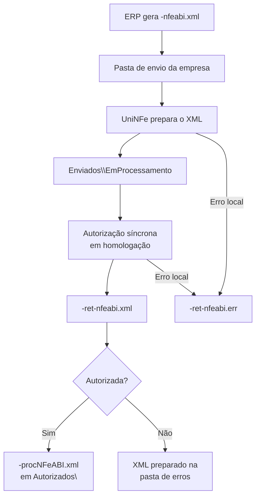

# Autorização síncrona de NF-e ABI

A autorização síncrona permite que o ERP envie uma NF-e ABI ao UniNFe por troca de arquivos. O UniNFe prepara o XML, usa as configurações da empresa e grava o retorno fiscal na pasta de retorno.

O serviço está disponível somente em homologação. Um XML com ambiente de produção não é transmitido.

## Pré-requisitos

Antes do envio, confira na configuração da empresa:

- A empresa, as pastas de envio, retorno e XMLs enviados estão configuradas.
- O ambiente da empresa e o XML usam homologação (`tpAmb` igual a `2`).
- O certificado digital está configurado e válido quando a empresa o utiliza.
- As configurações de proxy estão preenchidas, quando exigidas pela rede.
- O XML segue o leiaute NF-e ABI 1.00, o namespace `http://www.portalfiscal.inf.br/nfeabi` e o modelo fiscal `77`.

O arquivo [exemplo-nfeabi.xml no repositório](https://github.com/Unimake/Uninfe/blob/main/exemplos%20xml/NFeAbi/exemplo-nfeabi.xml) apresenta a estrutura de entrada com valores exclusivamente sintéticos. Substitua todos os dados demonstrativos pelos dados fiscais da operação e confira o leiaute aplicável antes do envio. O exemplo não contém assinatura: o UniNFe prepara e assina o documento durante o processamento.

## Arquivo de envio

Grave o XML na pasta de envio da empresa com o final fixo:

```text
<identificador>-nfeabi.xml
```

O identificador deve ser único para evitar conflito entre documentos. O XML deve ter a raiz `NFeABI` e a versão `1.00`.

## Fluxo de processamento

1. O ERP grava `<identificador>-nfeabi.xml` na pasta de envio.
2. O UniNFe identifica a NF-e ABI pelo conteúdo do XML e pelo final do arquivo.
3. O XML preparado é mantido em `Enviados\EmProcessamento` enquanto a autorização é concluída.
4. O UniNFe transmite a solicitação de forma síncrona e grava o retorno fiscal como `<identificador>-ret-nfeabi.xml`.
5. Quando a autorização for concluída com sucesso, o XML de distribuição `<identificador>-procNFeABI.xml` é gravado em `Enviados\Autorizados\<subpasta por data>`.
6. O XML original preparado é mantido em `Enviados\Autorizados\<subpasta por data>` ou `Enviados\Originais\<subpasta por data>`, conforme a configuração para salvar somente o XML de distribuição. A subpasta é formada pela organização por data configurada na empresa.
7. Se houver rejeição fiscal, o XML preparado é direcionado para a pasta de erros. Se ocorrer erro local, o UniNFe grava `<identificador>-ret-nfeabi.err` na pasta de retorno.



## Arquivos gerados e movimentados

| Momento | Pasta | Nome do arquivo |
|---|---|---|
| Solicitação do ERP | Pasta de envio | `<identificador>-nfeabi.xml` |
| Em processamento | `Enviados\EmProcessamento` | `<identificador>-nfeabi.xml` |
| Retorno fiscal | Pasta de retorno | `<identificador>-ret-nfeabi.xml` |
| Erro local | Pasta de retorno | `<identificador>-ret-nfeabi.err` |
| XML de distribuição autorizado | `Enviados\Autorizados\<subpasta por data>` | `<identificador>-procNFeABI.xml` |
| XML original autorizado | `Enviados\Autorizados\<subpasta por data>` ou `Enviados\Originais\<subpasta por data>` | `<identificador>-nfeabi.xml` |

## Como tratar o retorno

O ERP deve aguardar o arquivo `<identificador>-ret-nfeabi.xml` e analisar o status e o motivo retornados. A autorização é confirmada somente quando o retorno indicar sucesso e o XML `<identificador>-procNFeABI.xml` estiver disponível para armazenamento.

Em rejeição fiscal, corrija o XML no ERP e gere uma nova solicitação.

Um arquivo `.err` também pode representar uma falha ocorrida depois do início do transporte. Antes de qualquer nova tentativa, verifique o retorno fiscal e os artefatos já existentes para o mesmo pedido:

- Se houver retorno fiscal, XML processado ou XML autorizado, não gere uma nova solicitação. Preserve o pedido e as evidências para que o UniNFe conclua a retomada local; se a conclusão não ocorrer, encaminhe o conjunto ao suporte.
- Se o XML permanecer em `Enviados\EmProcessamento` sem retorno fiscal, o estado remoto é incerto. Não retransmita nem altere o arquivo manualmente; preserve as evidências e aguarde a conclusão do retorno ou a análise do suporte.
- Gere uma nova solicitação somente depois de confirmar que a falha ocorreu antes do transporte e que não existe retorno ou evidência pendente. Corrija antes a causa local indicada no `.err` — por exemplo, XML, ambiente, certificado, proxy, conexão TLS ou acesso às pastas.
