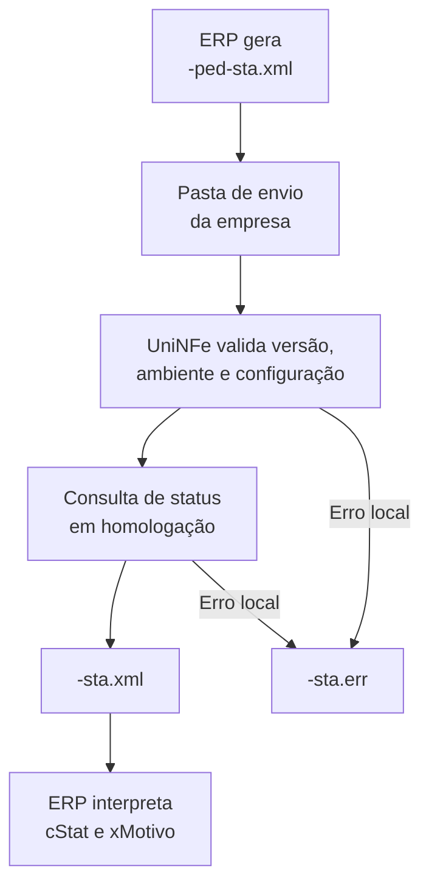

# Consulta status de serviço da NF-e ABI

A consulta status de serviço verifica a disponibilidade do serviço NF-e ABI para a UF indicada em `cUF` e para o ambiente informado. Ela não autoriza documento, não consulta protocolo e não gera XML de distribuição.

O serviço está disponível somente em homologação. Pedidos em produção não são transmitidos.

## Pré-requisitos

Antes de consultar, confira:

- A empresa e as pastas de envio e retorno estão configuradas.
- O XML e a configuração da empresa usam homologação (`tpAmb` igual a `2`).
- A UF informada em `cUF` corresponde ao serviço que será consultado.
- O certificado digital está configurado e válido quando a empresa o utiliza.
- As configurações de proxy estão preenchidas, quando exigidas pela rede.

## Arquivo de envio

Grave o pedido na pasta de envio da empresa com o final fixo:

```text
<identificador>-ped-sta.xml
```

O XML deve usar a raiz `consStatServNFeABI`, namespace `http://www.portalfiscal.inf.br/nfeabi`, versão `1.00` e `xServ` igual a `STATUS`. O valor de `tpAmb` deve ser o mesmo ambiente configurado para a empresa.

```xml
<?xml version="1.0" encoding="utf-8"?>
<consStatServNFeABI versao="1.00" xmlns="http://www.portalfiscal.inf.br/nfeabi">
  <tpAmb>2</tpAmb>
  <cUF>41</cUF>
  <xServ>STATUS</xServ>
</consStatServNFeABI>
```

O mesmo modelo está disponível em [consStatServNFeABI-ped-sta.xml no repositório](https://github.com/Unimake/Uninfe/blob/main/exemplos%20xml/NFeAbi/consStatServNFeABI-ped-sta.xml).

## Fluxo de processamento

1. O ERP grava `<identificador>-ped-sta.xml` na pasta de envio.
2. O UniNFe valida a versão, `xServ`, o ambiente e o certificado digital, quando utilizado, e aplica as configurações de conexão da empresa.
3. O UniNFe consulta o serviço em homologação.
4. O retorno original recebido do serviço é gravado, sem reformatação, como `<identificador>-sta.xml` na pasta de retorno.
5. Após o retorno, o arquivo de solicitação é removido.
6. Se ocorrer falha local, o UniNFe grava `<identificador>-sta.err` e não exclui o pedido, permitindo uma nova passagem do monitor depois da correção.



## Arquivos gerados

| Momento | Pasta | Nome do arquivo |
|---|---|---|
| Pedido de consulta | Pasta de envio | `<identificador>-ped-sta.xml` |
| Retorno fiscal | Pasta de retorno | `<identificador>-sta.xml` |
| Erro local | Pasta de retorno | `<identificador>-sta.err` |

## Como tratar o retorno

O ERP deve aguardar `<identificador>-sta.xml` e analisar principalmente `cStat` e `xMotivo` no retorno fiscal. Como o UniNFe preserva o XML original do serviço, os demais campos recebidos também ficam disponíveis ao integrador. Um retorno de disponibilidade permite continuar as operações de homologação; ele não representa autorização de NF-e ABI.

Quando houver `<identificador>-sta.err`, corrija a causa indicada antes de reenviar a consulta. O arquivo classifica falhas de certificado, proxy, TLS, DNS, configuração, retorno ou transporte sem expor o conteúdo técnico original da exceção. Verifique o XML, a configuração do ambiente e da UF, o certificado, o proxy, a conexão TLS e as permissões das pastas configuradas.
