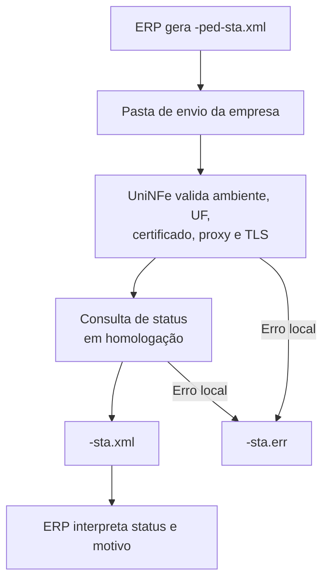

# Consulta status de serviço da NF-e ABI

A consulta status de serviço verifica a disponibilidade do serviço NF-e ABI para a UF e o ambiente informados. Ela não autoriza documento, não consulta protocolo e não gera XML de distribuição.

O serviço está disponível somente em homologação. Pedidos em produção não são transmitidos.

## Pré-requisitos

Antes de consultar, confira:

- A empresa e as pastas de envio e retorno estão configuradas.
- O XML e a configuração da empresa usam homologação (`tpAmb` igual a `2`).
- A UF do XML está correta para a consulta.
- O certificado digital está configurado e válido quando a empresa o utiliza.
- As configurações de proxy estão preenchidas, quando exigidas pela rede.

## Arquivo de envio

Grave o pedido na pasta de envio da empresa com o final fixo:

```text
<identificador>-ped-sta.xml
```

O XML deve usar a raiz `consStatServNFeABI`, namespace `http://www.portalfiscal.inf.br/nfeabi` e versão `1.00`.

```xml
<?xml version="1.0" encoding="utf-8"?>
<consStatServNFeABI versao="1.00" xmlns="http://www.portalfiscal.inf.br/nfeabi">
  <tpAmb>2</tpAmb>
  <cUF>41</cUF>
  <xServ>STATUS</xServ>
</consStatServNFeABI>
```

## Fluxo de processamento

1. O ERP grava `<identificador>-ped-sta.xml` na pasta de envio.
2. O UniNFe valida o ambiente e os dados do pedido.
3. O UniNFe consulta o serviço em homologação.
4. O retorno fiscal é gravado como `<identificador>-sta.xml` na pasta de retorno.
5. Após o retorno, o arquivo de solicitação é removido.
6. Se ocorrer falha local, o UniNFe grava `<identificador>-sta.err` e preserva o pedido para tratamento.



## Arquivos gerados

| Momento | Pasta | Nome do arquivo |
|---|---|---|
| Pedido de consulta | Pasta de envio | `<identificador>-ped-sta.xml` |
| Retorno fiscal | Pasta de retorno | `<identificador>-sta.xml` |
| Erro local | Pasta de retorno | `<identificador>-sta.err` |

## Como tratar o retorno

O ERP deve aguardar `<identificador>-sta.xml` e analisar os campos de status e motivo do retorno fiscal. Um retorno de disponibilidade permite continuar as operações de homologação; ele não representa autorização de NF-e ABI.

Quando houver `<identificador>-sta.err`, corrija a causa indicada antes de reenviar a consulta. Verifique o XML, a configuração do ambiente e UF, o certificado, o proxy, a conexão TLS e as permissões das pastas configuradas.
