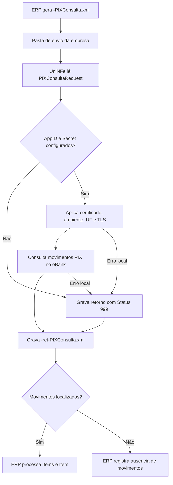

# Consultar movimentos PIX

O serviço de consulta de movimentos PIX permite que o ERP consulte no eBank os recebimentos PIX de uma conta em um período. O ERP grava o XML de solicitação na pasta de envio da empresa, o UniNFe executa a integração com o eBank e grava o XML de retorno na pasta de retorno.

Use este serviço quando a empresa precisa conciliar recebimentos PIX, localizar pagamentos processados pelo PSP e atualizar o ERP com os movimentos retornados.

## Pré-requisitos

Antes de enviar a consulta, confira na configuração da empresa:

- A empresa está cadastrada no UniNFe.
- A pasta de envio e a pasta de retorno estão configuradas.
- O certificado digital está configurado e válido quando exigido pela integração.
- O ambiente da empresa está configurado conforme a operação desejada.
- A UF da empresa está configurada.
- Os campos `e-bank - AppID` e `e-bank - Secret` estão preenchidos na aba de integrações da configuração da empresa.

Sem `AppID` e `Secret`, o UniNFe não executa o serviço e grava um retorno de erro para o ERP.

## Arquivo de envio

O ERP deve gerar o XML de consulta de movimentos PIX na pasta de envio da empresa com o final fixo:

```text
<identificador>-PIXConsulta.xml
```

O `<identificador>` deve ser único para a consulta. Ele pode ser uma data/hora, o período consultado ou outro controle do ERP.

Exemplo:

```text
20230523T103002-PIXConsulta.xml
```

O conteúdo do XML deve usar a estrutura `PIXConsultaRequest`:

```xml
<PIXConsultaRequest versao="1.00">
  <ConfigurationId>5465465465465465465456</ConfigurationId>
  <StartDate>2023-11-19</StartDate>
  <EndDate>2023-11-23</EndDate>
  <Testing>false</Testing>
  <Beneficiario>
    <Inscricao>99999999999999</Inscricao>
    <Nome>TESTE NOME DO BENEFICIARIO LTDA</Nome>
    <Conta>
      <Agencia>1111</Agencia>
      <Numero>11111</Numero>
      <Banco>111</Banco>
    </Conta>
  </Beneficiario>
  <UseHomologServer>false</UseHomologServer>
</PIXConsultaRequest>
```

## Campos principais

| Campo ou grupo | Como preencher |
|---|---|
| `ConfigurationId` | ID da configuração da conta no eBank. |
| `StartDate` | Data inicial do período consultado, no formato `AAAA-MM-DD`. |
| `EndDate` | Data final do período consultado, no formato `AAAA-MM-DD`. |
| `Testing` | Use `true` para ambiente de teste, quando o banco oferecer suporte. Use `false` para produção. |
| `Beneficiario` | Dados do titular da conta recebedora do PIX. O grupo é obrigatório no modelo de envio. |
| `Beneficiario/Inscricao` | CPF ou CNPJ do titular da conta recebedora. |
| `Beneficiario/Nome` | Nome do titular da conta recebedora. |
| `Beneficiario/Conta` | Agência, número da conta e código do banco do recebedor. |
| `UseHomologServer` | Campo opcional. Use somente quando for necessário direcionar a consulta para ambiente de homologação/depuração solicitado pelo eBank. |

O exemplo indica que o intervalo entre `StartDate` e `EndDate` deve ser de no máximo 5 dias.

## Fluxo de processamento

1. O ERP grava o arquivo `<identificador>-PIXConsulta.xml` na pasta de envio.
2. O UniNFe lê o XML e identifica a solicitação de consulta de movimentos PIX.
3. O UniNFe valida se `AppID` e `Secret` do eBank estão configurados para a empresa.
4. O UniNFe aplica as configurações da empresa, certificado, ambiente, UF e preparação TLS quando configurada.
5. A consulta é enviada ao eBank.
6. O retorno do eBank é gravado na pasta de retorno como `<identificador>-ret-PIXConsulta.xml`.
7. Se houver movimentos, o retorno contém o grupo `Items` com um ou mais `Item`.
8. Se ocorrer falha local ou falha retornada pela integração, o UniNFe grava o mesmo arquivo de retorno com status de erro.
9. O arquivo de solicitação é removido da pasta de envio após o processamento.

## Fluxograma



## Arquivos gerados

| Momento | Pasta | Nome do arquivo | Quando aparece |
|---|---|---|---|
| Pedido de consulta | Pasta de envio | `<identificador>-PIXConsulta.xml` | Arquivo criado pelo ERP para consultar movimentos PIX no eBank. |
| Retorno ao ERP | Pasta de retorno | `<identificador>-ret-PIXConsulta.xml` | Retorno XML recebido do eBank ou retorno de erro gerado pelo UniNFe. |

Este serviço não gera XML de distribuição fiscal, não movimenta arquivos para `Enviados\Autorizados` e não usa arquivo `.err` para o retorno principal do ERP. Falhas locais tratadas pelo UniNFe são devolvidas no XML `<identificador>-ret-PIXConsulta.xml`.

## Como tratar o retorno

O ERP deve monitorar a pasta de retorno e aguardar:

```text
<identificador>-ret-PIXConsulta.xml
```

O retorno usa a estrutura `PIXConsultaResponse`:

```xml
<?xml version="1.0" encoding="utf-8"?>
<PIXConsultaResponse>
  <Status>1</Status>
  <Motivo>Movimentos PIX localizados.</Motivo>
  <Items>
    <Item Id="1">
      <TxId>11111111111111111111111111111111</TxId>
      <Valor>75.36</Valor>
      <Horario>2023-10-31T16:29:41</Horario>
      <Pagador>
        <Nome>Teste nome pagador 1</Nome>
        <Inscricao>12345678901234</Inscricao>
      </Pagador>
    </Item>
  </Items>
</PIXConsultaResponse>
```

Campos principais do retorno:

| Campo | Como interpretar |
|---|---|
| `Status` | `1` indica movimentos PIX localizados. `2` indica que nenhum movimento foi localizado. `999` indica exceção ou erro. |
| `Motivo` | Descrição do resultado da consulta. |
| `Items` | Grupo com os movimentos PIX retornados. |
| `Item` | Movimento individual de PIX. Pode repetir. |
| `Item/@Id` | Identificador sequencial do item dentro do retorno. |
| `TxId` | Identificador do PIX. |
| `Valor` | Valor do PIX recebido. |
| `Horario` | Data e hora em que o PIX foi processado no PSP. |
| `Pagador` | Dados do pagador retornados para o movimento. |
| `TraceId` | Identificador de rastreio quando a integração retornar essa informação em falha tratada. |
| `UniNFeVersao` | Versão do UniNFe que gerou o retorno de erro local, quando aplicável. |

Quando o status indicar movimentos localizados, o ERP deve percorrer todos os grupos `Item` e conciliar os recebimentos pelo `TxId`, valor, horário e dados do pagador. Quando o status indicar ausência de movimentos, o ERP pode registrar a consulta como concluída sem recebimentos no período. Quando indicar erro, apresente o motivo ao usuário, corrija os dados ou a configuração e gere nova consulta.

## Erros comuns

As causas mais comuns de erro são:

- `AppID` ou `Secret` do eBank não configurados na empresa.
- XML fora da estrutura esperada.
- `ConfigurationId` ausente ou inválido.
- `StartDate` ou `EndDate` ausentes, inválidos ou com intervalo maior que o aceito pela integração.
- Dados do beneficiário ou da conta recebedora ausentes ou inválidos.
- Ambiente de teste, produção ou homologação incompatível com a credencial usada.
- Certificado digital ausente, inválido ou vencido quando exigido pela integração.
- Falha de comunicação com o eBank.
- Falha de permissão ou acesso às pastas configuradas.

Depois de corrigir o problema, gere novamente o arquivo `<identificador>-PIXConsulta.xml` na pasta de envio.

## Cuidados para o integrador

- Use sempre o final `-PIXConsulta.xml`.
- Controle o `<identificador>` para não sobrescrever retornos de consultas anteriores.
- Informe um período pequeno e compatível com a integração.
- Preencha `ConfigurationId`, `Beneficiario` e os dados da conta recebedora.
- Aguarde o arquivo `-ret-PIXConsulta.xml` para processar os movimentos.
- Trate múltiplos grupos `Item` no mesmo retorno.
- Use `TxId` como referência para conciliação com cobranças PIX criadas anteriormente.
- Trate `Status` igual a `999` como falha operacional que precisa de correção ou análise.
