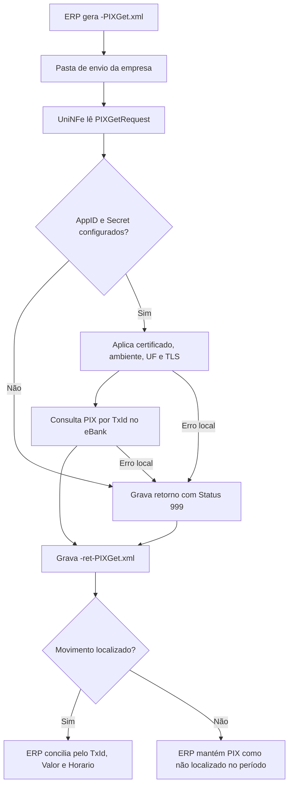

# Consultar PIX por TxId

O serviço de consulta de PIX por `TxId` permite que o ERP consulte no eBank a situação de uma cobrança PIX específica. O ERP grava o XML de solicitação na pasta de envio da empresa, o UniNFe executa a integração com o eBank e grava o XML de retorno na pasta de retorno.

Use este serviço quando a empresa precisa confirmar se uma cobrança PIX específica foi recebida, usando o `TxId` gerado na criação da cobrança.

## Pré-requisitos

Antes de enviar a consulta, confira na configuração da empresa:

- A empresa está cadastrada no UniNFe.
- A pasta de envio e a pasta de retorno estão configuradas.
- O certificado digital está configurado e válido quando exigido pela integração.
- O ambiente da empresa está configurado conforme a operação desejada.
- A UF da empresa está configurada.
- Os campos `e-bank - AppID` e `e-bank - Secret` estão preenchidos na aba de integrações da configuração da empresa.

Sem `AppID` e `Secret`, o UniNFe não executa o serviço e grava um retorno de erro para o ERP.

## Arquivo de envio

O ERP deve gerar o XML de consulta PIX na pasta de envio da empresa com o final fixo:

```text
<identificador>-PIXGet.xml
```

O `<identificador>` deve ser único para a consulta. Ele pode ser uma data/hora, o `TxId` ou outro controle do ERP.

Exemplo:

```text
20230523T103002-PIXGet.xml
```

O conteúdo do XML deve usar a estrutura `PIXGetRequest`:

```xml
<PIXGetRequest versao="1.00">
  <ConfigurationId>5465465465465465465456</ConfigurationId>
  <StartDate>2023-10-31</StartDate>
  <EndDate>2023-10-31</EndDate>
  <TxId>11111111111111111111111111111111</TxId>
  <Testing>false</Testing>
  <Beneficiario>
    <Inscricao>11111111111111</Inscricao>
    <Nome>EMPRESA TESTE</Nome>
    <Conta>
      <Agencia>1111</Agencia>
      <Numero>11111</Numero>
      <Banco>001</Banco>
    </Conta>
  </Beneficiario>
  <UseHomologServer>false</UseHomologServer>
</PIXGetRequest>
```

## Campos principais

| Campo ou grupo | Como preencher |
|---|---|
| `ConfigurationId` | ID da configuração da conta no eBank. |
| `StartDate` | Data inicial do período da consulta, no formato `AAAA-MM-DD`. |
| `EndDate` | Data final do período da consulta, no formato `AAAA-MM-DD`. |
| `TxId` | Identificador do PIX que será consultado. Deve ter entre 26 e 35 caracteres, usando somente letras e números. |
| `Testing` | Use `true` para ambiente de teste, quando o banco oferecer suporte. Use `false` para produção. |
| `Beneficiario` | Dados do titular da conta recebedora do PIX. O grupo é obrigatório no modelo de envio. |
| `Beneficiario/Inscricao` | CPF ou CNPJ do titular da conta recebedora. |
| `Beneficiario/Nome` | Nome do titular da conta recebedora. |
| `Beneficiario/Conta` | Agência, número da conta e código do banco do recebedor. |
| `UseHomologServer` | Campo opcional. Use somente quando for necessário direcionar a consulta para ambiente de homologação/depuração solicitado pelo eBank. |

## Fluxo de processamento

1. O ERP grava o arquivo `<identificador>-PIXGet.xml` na pasta de envio.
2. O UniNFe lê o XML e identifica a solicitação de consulta por `TxId`.
3. O UniNFe valida se `AppID` e `Secret` do eBank estão configurados para a empresa.
4. O UniNFe aplica as configurações da empresa, certificado, ambiente, UF e preparação TLS quando configurada.
5. A consulta é enviada ao eBank.
6. O retorno do eBank é gravado na pasta de retorno como `<identificador>-ret-PIXGet.xml`.
7. Se o movimento for localizado, o retorno informa `TxId`, valor, horário e pagador.
8. Se ocorrer falha local ou falha retornada pela integração, o UniNFe grava o mesmo arquivo de retorno com status de erro.
9. O arquivo de solicitação é removido da pasta de envio após o processamento.

## Fluxograma



## Arquivos gerados

| Momento | Pasta | Nome do arquivo | Quando aparece |
|---|---|---|---|
| Pedido de consulta | Pasta de envio | `<identificador>-PIXGet.xml` | Arquivo criado pelo ERP para consultar um PIX específico por `TxId`. |
| Retorno ao ERP | Pasta de retorno | `<identificador>-ret-PIXGet.xml` | Retorno XML recebido do eBank ou retorno de erro gerado pelo UniNFe. |

Este serviço não gera XML de distribuição fiscal, não movimenta arquivos para `Enviados\Autorizados` e não usa arquivo `.err` para o retorno principal do ERP. Falhas locais tratadas pelo UniNFe são devolvidas no XML `<identificador>-ret-PIXGet.xml`.

## Como tratar o retorno

O ERP deve monitorar a pasta de retorno e aguardar:

```text
<identificador>-ret-PIXGet.xml
```

O retorno usa a estrutura `PIXGetResponse`:

```xml
<?xml version="1.0" encoding="utf-8"?>
<PIXGetResponse>
  <Status>1</Status>
  <Motivo>Movimento PIX Localizado.</Motivo>
  <TxId>12345678901234567890123456</TxId>
  <Valor>0.00</Valor>
  <Horario>2023-05-23T10:42:05</Horario>
  <Pagador>
    <Nome>Teste nome pagador</Nome>
    <Inscricao>12345678901234</Inscricao>
  </Pagador>
</PIXGetResponse>
```

Campos principais do retorno:

| Campo | Como interpretar |
|---|---|
| `Status` | `1` indica movimento PIX localizado. `2` indica que nenhum movimento foi localizado. `999` indica exceção ou erro. |
| `Motivo` | Descrição do resultado da consulta. |
| `TxId` | Identificador do PIX consultado. |
| `Valor` | Valor do PIX recebido. |
| `Horario` | Data e hora em que o PIX foi processado no PSP. |
| `Pagador` | Dados do pagador retornados para o movimento. |
| `TraceId` | Identificador de rastreio quando a integração retornar essa informação em falha tratada. |
| `UniNFeVersao` | Versão do UniNFe que gerou o retorno de erro local, quando aplicável. |

Quando o status indicar movimento localizado, o ERP deve conciliar a cobrança pelo `TxId` e atualizar o pagamento com o valor, horário e dados do pagador. Quando o status indicar ausência de movimento, o ERP pode manter a cobrança como não recebida no período consultado. Quando indicar erro, apresente o motivo ao usuário, corrija os dados ou a configuração e gere nova consulta.

## Erros comuns

As causas mais comuns de erro são:

- `AppID` ou `Secret` do eBank não configurados na empresa.
- XML fora da estrutura esperada.
- `ConfigurationId` ausente ou inválido.
- `TxId` ausente, fora do tamanho esperado ou com caracteres inválidos.
- `StartDate` ou `EndDate` ausentes ou inválidos.
- Dados do beneficiário ou da conta recebedora ausentes ou inválidos.
- Ambiente de teste, produção ou homologação incompatível com a credencial usada.
- Certificado digital ausente, inválido ou vencido quando exigido pela integração.
- Falha de comunicação com o eBank.
- Falha de permissão ou acesso às pastas configuradas.

Depois de corrigir o problema, gere novamente o arquivo `<identificador>-PIXGet.xml` na pasta de envio.

## Cuidados para o integrador

- Use sempre o final `-PIXGet.xml`.
- Controle o `<identificador>` para não sobrescrever retornos de consultas anteriores.
- Informe o mesmo `TxId` usado na criação da cobrança PIX.
- Preencha `ConfigurationId`, `Beneficiario` e os dados da conta recebedora.
- Informe período compatível com a data esperada do recebimento.
- Aguarde o arquivo `-ret-PIXGet.xml` para atualizar a situação da cobrança.
- Trate `Status` igual a `1` como movimento localizado e `2` como não localizado.
- Trate `Status` igual a `999` como falha operacional que precisa de correção ou análise.
