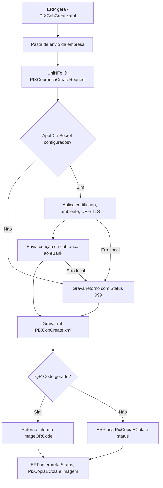

# Criar cobrança PIX

O serviço de criação de cobrança PIX permite que o ERP solicite ao eBank a geração de uma cobrança PIX. O ERP grava o XML de solicitação na pasta de envio da empresa, o UniNFe executa a integração com o eBank e grava o XML de retorno na pasta de retorno.

Use este serviço quando a empresa precisa gerar uma cobrança PIX com identificador próprio, valor, chave do recebedor e, quando necessário, QR Code para pagamento.

## Pré-requisitos

Antes de enviar a solicitação, confira na configuração da empresa:

- A empresa está cadastrada no UniNFe.
- A pasta de envio e a pasta de retorno estão configuradas.
- O certificado digital está configurado e válido quando exigido pela integração.
- O ambiente da empresa está configurado conforme a operação desejada.
- A UF da empresa está configurada.
- Os campos `e-bank - AppID` e `e-bank - Secret` estão preenchidos na aba de integrações da configuração da empresa.

Sem `AppID` e `Secret`, o UniNFe não executa o serviço e grava um retorno de erro para o ERP.

## Arquivo de envio

O ERP deve gerar o XML de criação de cobrança PIX na pasta de envio da empresa com o final fixo:

```text
<identificador>-PIXCobCreate.xml
```

O `<identificador>` deve ser único para a solicitação. Ele pode ser uma data/hora, o `TxId` ou outro controle do ERP.

Exemplo:

```text
20230523T103002-PIXCobCreate.xml
```

O conteúdo do XML deve usar a estrutura `PIXCobrancaCreateRequest`:

```xml
<?xml version="1.0" encoding="utf-8"?>
<PIXCobrancaCreateRequest versao="1.00">
  <ConfigurationId>5465465465465465465456</ConfigurationId>
  <SolicitacaoPagador>Prestação de serviços em software</SolicitacaoPagador>
  <TipoCobranca>0</TipoCobranca>
  <Valor>1.00</Valor>
  <Chave>+5544999999999</Chave>
  <TxId>12345678901234567890123456789012345</TxId>
  <GerarQRCode>true</GerarQRCode>
  <Testing>false</Testing>
  <Beneficiario>
    <Inscricao>11222333000122</Inscricao>
    <Nome>Empresa Teste</Nome>
    <Conta>
      <Agencia>1111</Agencia>
      <Numero>1111111</Numero>
      <Banco>756</Banco>
    </Conta>
  </Beneficiario>
  <Calendario>
    <Criacao>2023-05-23T10:42:05</Criacao>
    <Expiracao>600</Expiracao>
    <DataDeVencimento>2023-05-23T10:42:05</DataDeVencimento>
    <ValidadeAposVencimento>3</ValidadeAposVencimento>
  </Calendario>
  <QRCodeConfig>
    <Width>512</Width>
    <Height>512</Height>
    <Quality>100</Quality>
    <ImageFormat>2</ImageFormat>
  </QRCodeConfig>
  <Devedor>
    <Nome>Devedor de teste</Nome>
    <Inscricao>00000000000</Inscricao>
    <CEP>87700000</CEP>
    <Logradouro>Rua sao joao do joao, 111, Jardim teste</Logradouro>
    <Cidade>Paranavaí</Cidade>
    <UF>PR</UF>
  </Devedor>
  <UseHomologServer>false</UseHomologServer>
</PIXCobrancaCreateRequest>
```

## Campos principais

| Campo ou grupo | Como preencher |
|---|---|
| `ConfigurationId` | ID da configuração da conta no eBank. |
| `SolicitacaoPagador` | Texto livre exibido ao pagador. O exemplo indica limite de 140 caracteres. |
| `TipoCobranca` | Use `0` para cobrança simples sem vencimento, multa ou juros. Use `1` para cobrança com vencimento. |
| `Valor` | Valor da cobrança PIX, usando ponto como separador decimal. |
| `Chave` | Chave PIX do recebedor. |
| `TxId` | Identificador da cobrança PIX. Deve ter entre 26 e 35 caracteres, usando somente letras e números. |
| `GerarQRCode` | Use `true` para gerar imagem do QR Code; use `false` para não gerar imagem. |
| `Testing` | Use `true` para ambiente de teste, quando o banco oferecer suporte. Use `false` para produção. |
| `Beneficiario` | Dados do recebedor do PIX. O grupo é obrigatório no modelo de envio. |
| `Beneficiario/Conta` | Agência, número da conta e código do banco do recebedor. |
| `Calendario` | Dados de criação, expiração e vencimento da cobrança. Para `TipoCobranca` igual a `1`, informe este grupo conforme a regra da operação. |
| `QRCodeConfig` | Configuração da imagem do QR Code quando `GerarQRCode` for `true`. |
| `Devedor` | Dados do devedor. Para `TipoCobranca` igual a `1`, informe este grupo conforme a regra da operação. |
| `UseHomologServer` | Campo opcional. Use somente quando for necessário direcionar a solicitação para ambiente de homologação/depuração solicitado pelo eBank. |

## Fluxo de processamento

1. O ERP grava o arquivo `<identificador>-PIXCobCreate.xml` na pasta de envio.
2. O UniNFe lê o XML e identifica a solicitação de criação de cobrança PIX.
3. O UniNFe valida se `AppID` e `Secret` do eBank estão configurados para a empresa.
4. O UniNFe aplica as configurações da empresa, certificado, ambiente, UF e preparação TLS quando configurada.
5. A solicitação é enviada ao eBank.
6. O retorno do eBank é gravado na pasta de retorno como `<identificador>-ret-PIXCobCreate.xml`.
7. Se a cobrança solicitar QR Code e a integração retornar a imagem, o retorno informa o caminho da imagem gerada.
8. Se ocorrer falha local ou falha retornada pela integração, o UniNFe grava o mesmo arquivo de retorno com status de erro.
9. O arquivo de solicitação é removido da pasta de envio após o processamento.

## Fluxograma



## Arquivos gerados

| Momento | Pasta | Nome do arquivo | Quando aparece |
|---|---|---|---|
| Pedido de criação | Pasta de envio | `<identificador>-PIXCobCreate.xml` | Arquivo criado pelo ERP para gerar a cobrança PIX no eBank. |
| Retorno ao ERP | Pasta de retorno | `<identificador>-ret-PIXCobCreate.xml` | Retorno XML recebido do eBank ou retorno de erro gerado pelo UniNFe. |
| Imagem do QR Code | Pasta de retorno, quando gerada pela integração | `<identificador>-ret-PIXCobCreate.<extensão da imagem>` | Imagem indicada no retorno quando `GerarQRCode` for `true` e a integração gerar o arquivo. |

Este serviço não gera XML de distribuição fiscal, não movimenta arquivos para `Enviados\Autorizados` e não usa arquivo `.err` para o retorno principal do ERP. Falhas locais tratadas pelo UniNFe são devolvidas no XML `<identificador>-ret-PIXCobCreate.xml`.

## Como tratar o retorno

O ERP deve monitorar a pasta de retorno e aguardar:

```text
<identificador>-ret-PIXCobCreate.xml
```

O retorno usa a estrutura `PIXCobrancaCreateResponse`:

```xml
<?xml version="1.0" encoding="utf-8"?>
<PIXCobrancaCreateResponse>
  <Status>0</Status>
  <Motivo>PIX Ativo (Cobrança gerada)</Motivo>
  <PixCopiaECola>11111111111111111111br.gov.bcb.pix...</PixCopiaECola>
  <ImageQRCode>d:\testenfe\Retorno\20230523T103002-ret-PIXCobCreate.png</ImageQRCode>
</PIXCobrancaCreateResponse>
```

Campos principais do retorno:

| Campo | Como interpretar |
|---|---|
| `Status` | `0` indica cobrança ativa. `1` indica concluída. `2` indica removida pelo usuário recebedor. `3` indica removida pelo PSP. `999` indica exceção ou erro. |
| `Motivo` | Descrição do status retornado. |
| `PixCopiaECola` | Texto PIX copia e cola para pagamento. |
| `ImageQRCode` | Caminho da imagem do QR Code gerada para pagamento, quando houver. |
| `TraceId` | Identificador de rastreio quando a integração retornar essa informação em falha tratada. |
| `UniNFeVersao` | Versão do UniNFe que gerou o retorno de erro local, quando aplicável. |

Quando o status indicar cobrança ativa, o ERP deve armazenar o `TxId`, o PIX copia e cola e o caminho da imagem do QR Code quando existir. Quando indicar erro, o ERP deve apresentar o motivo ao usuário, corrigir os dados ou a configuração e gerar nova solicitação.

## Erros comuns

As causas mais comuns de erro são:

- `AppID` ou `Secret` do eBank não configurados na empresa.
- XML fora da estrutura esperada.
- `ConfigurationId` ausente ou inválido.
- `TxId` fora do tamanho esperado ou com caracteres inválidos.
- `Valor`, `Chave` ou dados do beneficiário ausentes ou inválidos.
- Dados de calendário ou devedor ausentes quando a cobrança com vencimento exigir essas informações.
- Ambiente de teste, produção ou homologação incompatível com a credencial usada.
- Certificado digital ausente, inválido ou vencido quando exigido pela integração.
- Falha de comunicação com o eBank.
- Falha de permissão ou acesso às pastas configuradas.

Depois de corrigir o problema, gere novamente o arquivo `<identificador>-PIXCobCreate.xml` na pasta de envio.

## Cuidados para o integrador

- Use sempre o final `-PIXCobCreate.xml`.
- Controle o `<identificador>` para não sobrescrever retornos de solicitações anteriores.
- Gere `TxId` único e válido para permitir consultas posteriores da cobrança.
- Use ponto como separador decimal em `Valor`.
- Informe `Beneficiario` e os dados da conta recebedora.
- Informe `Calendario` e `Devedor` quando usar cobrança com vencimento.
- Aguarde o arquivo `-ret-PIXCobCreate.xml` para saber se a cobrança foi criada.
- Armazene `PixCopiaECola` e `ImageQRCode` quando retornados.
- Trate `Status` igual a `999` como falha operacional que precisa de correção ou análise.
