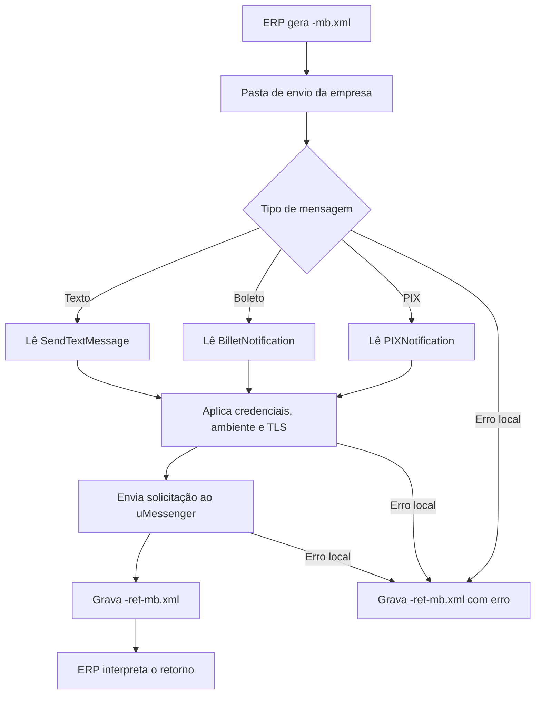

# Envio de mensagens pelo uMessenger

O serviço de envio de mensagens pelo uMessenger permite que o ERP solicite ao UniNFe o envio de mensagens pelo WhatsApp. A integração é feita por troca de arquivos XML: o ERP grava a solicitação na pasta de envio da empresa e o UniNFe grava o retorno na pasta configurada para retornos.

O serviço atende mensagens de texto e notificações relacionadas a boleto e PIX, conforme a estrutura informada no XML.

## Quando usar

Use este serviço quando:

- O ERP precisa enviar uma mensagem de texto para um número de WhatsApp.
- O ERP precisa enviar uma notificação de boleto para o cliente.
- O ERP precisa enviar uma notificação de cobrança PIX para o cliente.
- O integrador precisa controlar o envio por arquivo, mantendo o retorno gravado pelo UniNFe.

## Pré-requisitos

Antes de enviar mensagens, confira na configuração da empresa:

- A empresa está cadastrada no UniNFe.
- A pasta de envio e a pasta de retorno estão configuradas.
- As credenciais do uMessenger estão preenchidas na aba de integrações.
- Se a opção de usar as mesmas credenciais do e-bank estiver marcada, as credenciais do e-bank estão configuradas corretamente.
- As configurações de proxy e conexão TLS estão corretas, se a rede exigir proxy ou preparação TLS.
- O XML contém o número de destino no formato esperado pela integração.

## Arquivo de envio

O ERP deve gerar o arquivo XML na pasta de envio da empresa com o final fixo:

```text
<identificador>-mb.xml
```

O `<identificador>` deve ser único para a solicitação. Ele pode ser uma data/hora, uma identificação interna do ERP ou outro código que permita relacionar o pedido ao retorno.

Exemplos:

```text
Text_20230523T103002-mb.xml
Boleto_20230523T103002-mb.xml
PIX_20230523T103002-mb.xml
```

## Mensagem de texto

Use a estrutura `SendTextMessage` para enviar uma mensagem de texto. A mensagem pode conter arquivos anexos, quando informados no grupo `Files`.

```xml
<uMessenger versao="1.00">
  <SendTextMessage Id="01">
    <InstanceName>1ff66742aa6044c1bbf88e0e1f143d8f</InstanceName>
    <To>5544991423078</To>
    <Text>Olá, Escreva a sua mensagem aqui ...</Text>
    <Testing>false</Testing>
    <Files>
      <File>
        <FullPath>d:\testenfe\teste.pdf</FullPath>
        <MediaType>2</MediaType>
      </File>
    </Files>
  </SendTextMessage>
</uMessenger>
```

Campos principais:

| Campo | Como preencher |
|---|---|
| `uMessenger` | Elemento principal da solicitação. |
| `SendTextMessage/@Id` | Identificador da mensagem dentro do XML. |
| `InstanceName` | Instância do uMessenger usada para o envio. |
| `To` | Número de WhatsApp do destinatário. |
| `Text` | Texto da mensagem. |
| `Testing` | Indica se a mensagem será enviada em modo de teste. |
| `Files/File/FullPath` | Caminho do arquivo que será anexado à mensagem. |
| `Files/File/MediaType` | Tipo de mídia do arquivo anexado. |

## Notificação de boleto

Use a estrutura `BilletNotification` para enviar dados de uma cobrança por boleto:

```xml
<?xml version="1.0" encoding="utf-8"?>
<uMessenger versao="1.00">
  <BilletNotification>
    <BarCode>65465464646554456453456453456544565445645345654435</BarCode>
    <BilletNumber>12345678</BilletNumber>
    <CompanyName>Unimake Software</CompanyName>
    <ContactPhone>5544888889999</ContactPhone>
    <CustomerName>Joaquim</CustomerName>
    <Description>UniDANFe - Licença de 1 ano</Description>
    <DueDate>04/07/2023</DueDate>
    <QueryString>http://unimake.app.api/v1/pdf/download?Code=s65a4ds6a54ds6a4ds4ad54sa6d54as5dsa645d56sa4</QueryString>
    <To>554491423078</To>
    <Value>R$ 250,00</Value>
    <Testing>true</Testing>
    <UseHomologServer>false</UseHomologServer>
  </BilletNotification>
</uMessenger>
```

Campos principais:

| Campo | Como preencher |
|---|---|
| `BilletNotification` | Grupo com os dados da notificação de boleto. |
| `BarCode` | Código de barras do boleto. |
| `BilletNumber` | Número do boleto. |
| `CompanyName` | Nome da empresa que emitiu o boleto. |
| `ContactPhone` | Telefone de contato exibido ao destinatário. |
| `CustomerName` | Nome do cliente ou destinatário. |
| `Description` | Descrição da cobrança. |
| `DueDate` | Data de vencimento do boleto. |
| `QueryString` | Link ou informação para acesso ao boleto. |
| `To` | Número de WhatsApp do destinatário. |
| `Value` | Valor do boleto no formato que será enviado na mensagem. |
| `Testing` | Indica se a mensagem será enviada em modo de teste. |
| `UseHomologServer` | Indica uso do servidor de homologação quando necessário. |

## Notificação de PIX

Use a estrutura `PIXNotification` para enviar dados de uma cobrança PIX:

```xml
<?xml version="1.0" encoding="utf-8"?>
<uMessenger versao="1.00">
  <PIXNotification>
    <CopyAndPaste>00011111111111111111BR.GOV.BCB.PIX2222...</CopyAndPaste>
    <CompanyName>Unimake Software</CompanyName>
    <ContactPhone>554431421010</ContactPhone>
    <CustomerName>Joaquim</CustomerName>
    <Description>UniDANFe - Licença de 1 ano</Description>
    <IssuedDate>30/07/2024</IssuedDate>
    <QueryString>http://unimake.app.api/v1/pdf/download?Code=s65a4ds6a54ds6a4ds4ad54sa6d54as5dsa645d56sa4</QueryString>
    <To>554491423078</To>
    <Value>R$ 250,00</Value>
    <Testing>true</Testing>
    <UseHomologServer>true</UseHomologServer>
  </PIXNotification>
</uMessenger>
```

Campos principais:

| Campo | Como preencher |
|---|---|
| `PIXNotification` | Grupo com os dados da notificação de PIX. |
| `CopyAndPaste` | Código PIX para pagamento por copia e cola. |
| `CompanyName` | Nome da empresa que gerou o PIX. |
| `ContactPhone` | Telefone de contato exibido ao destinatário. |
| `CustomerName` | Nome do destinatário da cobrança. |
| `Description` | Descrição da cobrança. |
| `IssuedDate` | Data de emissão da cobrança PIX. |
| `QueryString` | Link ou informação para pagamento por QR Code. |
| `To` | Número de WhatsApp do destinatário. |
| `Value` | Valor da cobrança PIX no formato que será enviado na mensagem. |
| `Testing` | Indica se a mensagem será enviada em modo de teste. |
| `UseHomologServer` | Indica uso do servidor de homologação quando necessário. |

## Fluxo de processamento

1. O ERP grava `<identificador>-mb.xml` na pasta de envio da empresa.
2. O UniNFe identifica o XML como solicitação do uMessenger.
3. O UniNFe lê o XML e aplica as configurações da empresa, incluindo ambiente, UF, preparação TLS, AppID e Secret do uMessenger.
4. A solicitação é enviada ao serviço do uMessenger.
5. O retorno é gravado como `<identificador>-ret-mb.xml` na pasta de retorno.
6. Se ocorrer falha local antes ou durante o envio, o UniNFe grava `<identificador>-ret-mb.xml` com status de erro.
7. O arquivo de solicitação é removido da pasta de envio após o processamento.

## Fluxograma



## Arquivos gerados

| Momento | Pasta | Nome do arquivo | Quando aparece |
|---|---|---|---|
| Pedido | Pasta de envio | `<identificador>-mb.xml` | Arquivo criado pelo ERP para solicitar o envio pelo uMessenger. |
| Retorno | Pasta de retorno | `<identificador>-ret-mb.xml` | Retorno XML do envio da mensagem ou da falha local. |

## Como tratar o retorno

O ERP deve monitorar a pasta de retorno e aguardar:

```text
<identificador>-ret-mb.xml
```

O retorno usa a raiz `uMessengerResponse` e contém um ou mais grupos `Mensagem`. Em cada mensagem, analise principalmente:

| Campo | Significado |
|---|---|
| `Mensagem/@Id` | Identificador da mensagem, quando informado no pedido. |
| `Status` | Código de status do envio. |
| `Motivo` | Descrição do resultado. |
| `messageID` | Identificador retornado para a mensagem enviada com sucesso. |
| `TraceId` | Identificador técnico retornado em algumas falhas. |
| `UniNFeVersao` | Versão do UniNFe que gerou o retorno. |

Exemplo de retorno:

```xml
<?xml version="1.0" encoding="utf-8"?>
<uMessengerResponse>
  <Mensagem Id="01">
    <Status>1</Status>
    <Motivo>Mensagem enviada com sucesso.</Motivo>
    <messageID>BAE572D1B77AFA4E</messageID>
    <UniNFeVersao>5.1.0.138 | 07-04-2025 - 14:02:13</UniNFeVersao>
  </Mensagem>
</uMessengerResponse>
```

Quando ocorrer falha local, o UniNFe grava o mesmo arquivo de retorno `-ret-mb.xml`, informando o status e o motivo do erro. O serviço não usa arquivo `.err` próprio para este contrato.

## Erros locais

As causas mais comuns de retorno com erro são:

- XML fora da estrutura esperada.
- Solicitação sem `SendTextMessage`, `BilletNotification` ou `PIXNotification`.
- Número de destino ausente ou inválido.
- Dados obrigatórios da mensagem, boleto ou PIX ausentes.
- AppID ou Secret do uMessenger não configurado.
- Ambiente ou credenciais incompatíveis com o serviço.
- Arquivo anexo inexistente ou inacessível, quando a mensagem possui anexos.
- Proxy ou conexão TLS configurados incorretamente.
- Falha de comunicação com o serviço do uMessenger.
- Falha de permissão ou acesso às pastas configuradas.

Depois de corrigir o problema, gere novamente o arquivo `<identificador>-mb.xml` na pasta de envio.

## Cuidados para o integrador

- Use sempre o final `-mb.xml` no arquivo de envio.
- Aguarde sempre o retorno `-ret-mb.xml`.
- Não espere retorno `.err` para este serviço; falhas locais também são registradas no XML de retorno.
- Use `SendTextMessage` para mensagens de texto.
- Use `BilletNotification` para notificações de boleto.
- Use `PIXNotification` para notificações de PIX.
- Guarde o `messageID` retornado quando a mensagem for enviada com sucesso.
- Em retornos de erro, corrija a causa indicada em `Motivo` antes de reenviar a solicitação.
