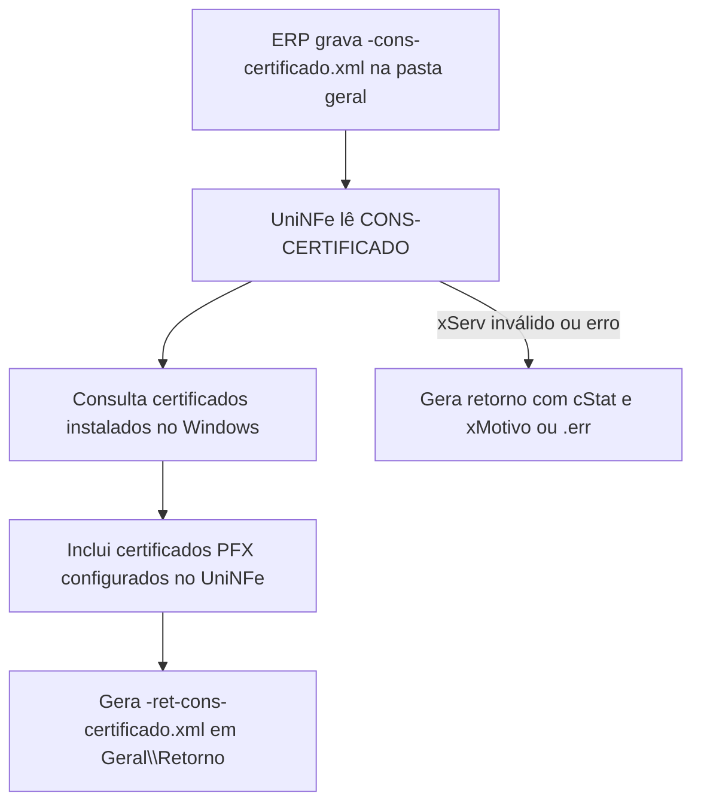

# Consulta de certificados digitais do UniNFe

A consulta de certificados digitais permite que o ERP solicite ao UniNFe a lista de certificados disponíveis no computador onde o UniNFe está em execução.

Esse serviço é local ao UniNFe. Ele não consulta a SEFAZ, não envia documento fiscal e não autoriza XML. Use para apoiar configuração, diagnóstico e seleção do certificado digital que será usado pelas empresas cadastradas.

O retorno inclui certificados instalados no repositório do Windows e certificados A1 em arquivo `.PFX` configurados no UniNFe.

## Quando usar

Use este serviço quando:

- o ERP precisa listar certificados digitais disponíveis para configuração;
- o suporte precisa conferir se o certificado está acessível no computador do UniNFe;
- o usuário precisa identificar o `ThumbPrint` de um certificado instalado no Windows;
- o ERP precisa verificar validade, assunto, número de série e indicação de certificado A3;
- o suporte precisa confirmar certificados A1 configurados por arquivo `.PFX`.

Para consultar versão do UniNFe, computador, usuário, certificado configurado em uma empresa e configurações da empresa, use a [consulta de informações do UniNFe](consulta-informacoes.md).

## Onde gravar o arquivo

O ERP deve gravar o pedido na pasta geral do UniNFe:

```text
Geral
```

O retorno é gravado em:

```text
Geral\Retorno
```

A pasta geral padrão fica abaixo da pasta de instalação do UniNFe. Se houver arquivo `UniNFePastaGeral.xml` configurando uma pasta geral personalizada, a pasta `Geral` será considerada dentro do caminho definido nesse arquivo.

## Envio

Para consultar certificados digitais, o ERP deve gerar na pasta geral um arquivo XML com o final:

```text
<identificador>-cons-certificado.xml
```

Exemplo:

```text
uninfe-cons-certificado.xml
```

Conteúdo:

```xml
<?xml version="1.0" encoding="utf-8"?>
<ConsCertificado>
  <xServ>CONS-CERTIFICADO</xServ>
</ConsCertificado>
```

## Retorno

Quando a consulta é processada com sucesso, o UniNFe grava em `Geral\Retorno`:

```text
<identificador>-ret-cons-certificado.xml
```

Exemplo:

```text
uninfe-ret-cons-certificado.xml
```

Estrutura do retorno:

```xml
<?xml version="1.0" encoding="utf-8"?>
<Certificados>
  <ThumbPrint ID="...">
    <Subject>...</Subject>
    <ValidadeInicial>...</ValidadeInicial>
    <ValidadeFinal>...</ValidadeFinal>
    <A3>false</A3>
    <SerialNumber>...</SerialNumber>
    <PastaCertificado>...</PastaCertificado>
  </ThumbPrint>
</Certificados>
```

O grupo `PastaCertificado` aparece para certificados A1 configurados no UniNFe por arquivo `.PFX`. Para certificados instalados no Windows, esse grupo pode não existir.

Se não houver certificados compatíveis, o retorno pode ser gerado com `<Certificados />`.

## Campos retornados

| Campo | Significado |
|---|---|
| `Certificados` | Grupo raiz com os certificados encontrados. |
| `ThumbPrint` | Grupo de um certificado retornado. |
| `ID` | ThumbPrint do certificado. É o valor usado para configurar certificado instalado no Windows. |
| `Subject` | Assunto do certificado, com dados como CN, organização, localidade e país, conforme gravado no certificado. |
| `ValidadeInicial` | Data inicial de validade do certificado. |
| `ValidadeFinal` | Data final de validade do certificado. |
| `A3` | Indica se o certificado foi identificado como A3. |
| `SerialNumber` | Número de série do certificado. |
| `PastaCertificado` | Caminho do arquivo `.PFX`, quando o certificado A1 está configurado no UniNFe por arquivo. |

## Fluxo operacional

1. O ERP grava `<identificador>-cons-certificado.xml` na pasta geral do UniNFe.
2. O UniNFe identifica o serviço pelo final do nome do arquivo.
3. O UniNFe lê o XML e confirma o valor `CONS-CERTIFICADO`.
4. O UniNFe consulta os certificados digitais instalados no Windows.
5. O UniNFe adiciona ao retorno os certificados A1 em `.PFX` configurados nas empresas, quando existirem e estiverem acessíveis.
6. O retorno é gravado em `Geral\Retorno`.
7. O arquivo de solicitação é removido após o processamento.
8. Se ocorrer falha ao gerar o retorno, o UniNFe grava um retorno com `cStat` e `xMotivo` ou um arquivo `.err` quando possível.



## Arquivos envolvidos

| Etapa | Pasta | Arquivo | O que significa |
|---|---|---|---|
| Pedido XML | Pasta geral | `<identificador>-cons-certificado.xml` | Solicitação para listar certificados digitais disponíveis. |
| Retorno XML | `Geral\Retorno` | `<identificador>-ret-cons-certificado.xml` | Lista de certificados digitais encontrados. |
| Erro local | `Geral\Retorno` | `<identificador>-ret-cons-certificado.err` | Falha local ao gerar ou gravar o retorno, quando não for possível gerar o XML de retorno. |

## Retornos de erro

Quando o XML não contém o serviço esperado em `xServ`, o UniNFe grava um retorno XML com:

```xml
<?xml version="1.0" encoding="utf-8"?>
<retCadConfUniNFe>
  <cStat>3</cStat>
  <xMotivo>...</xMotivo>
</retCadConfUniNFe>
```

Quando ocorre erro ao consultar os certificados, o retorno usa `cStat` igual a `2` e `xMotivo` com a descrição do problema.

Se houver falha ao gravar esse retorno XML, o UniNFe tenta gravar um arquivo `.err` em `Geral\Retorno`.

## Erros comuns

As causas mais comuns de erro são:

- arquivo gravado fora da pasta geral;
- nome do arquivo sem o final `-cons-certificado.xml`;
- `xServ` ausente ou diferente de `CONS-CERTIFICADO`;
- falta de permissão de leitura ou gravação na pasta geral, `Temp` ou `Retorno`;
- certificado A1 em `.PFX` configurado com caminho inválido ou inacessível;
- certificado instalado sem permissão de acesso para o usuário que executa o UniNFe ou o serviço do Windows;
- antivírus, política de segurança ou perfil de usuário impedindo acesso ao repositório de certificados do Windows.

## Cuidados para o integrador

- Use `-cons-certificado.xml` somente na pasta geral do UniNFe.
- Leia o retorno em `Geral\Retorno`.
- Use o valor do atributo `ID` de `ThumbPrint` para configurar certificado instalado no Windows.
- Não trate a ausência de certificados como erro de comunicação fiscal; este serviço é local ao computador do UniNFe.
- Para obter dados do certificado configurado em uma empresa específica, use a consulta de informações pela pasta de envio da empresa.
