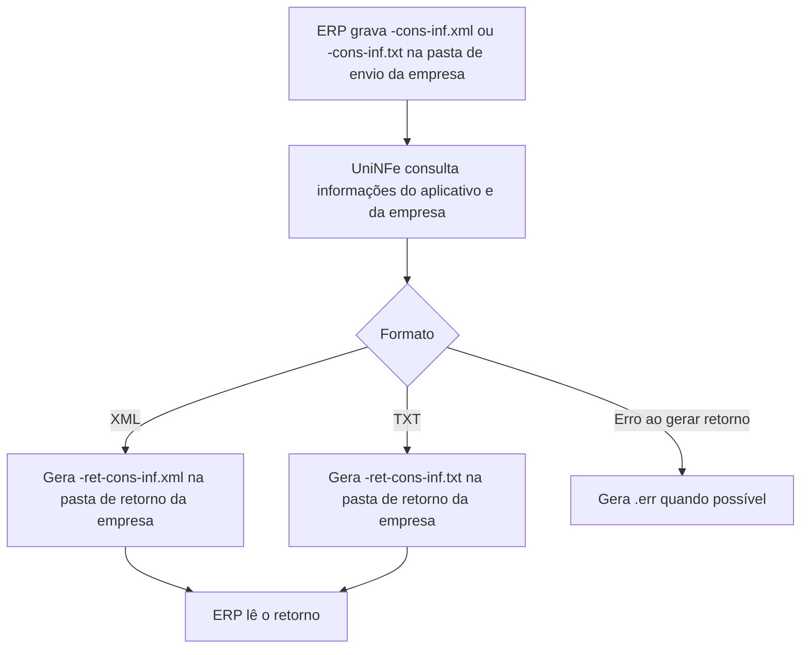

# Consulta de informações do UniNFe

A consulta de informações permite que o ERP solicite ao UniNFe dados úteis para diagnóstico, suporte e integração, como versão do aplicativo, pasta de instalação, computador, usuário em execução, modo de execução, conexão com a internet, dados do certificado digital e configurações da empresa.

Esse serviço é local ao UniNFe. Ele não consulta a SEFAZ, não envia documento fiscal e não autoriza nenhum XML.

## Quando usar

Use este serviço quando:

- o ERP precisa exibir ou validar a versão do UniNFe instalada;
- o suporte precisa confirmar em qual computador e usuário o UniNFe está executando;
- o ERP precisa verificar a validade do certificado configurado para uma empresa;
- o ERP precisa ler configurações da empresa cadastrada no UniNFe;
- o suporte precisa confirmar se o UniNFe está rodando como aplicativo ou como serviço do Windows;
- o ERP precisa registrar informações de diagnóstico para atendimento.

Para listar certificados disponíveis no computador, use a [consulta de certificados digitais](consulta-informacoes-certificados.md).

## Onde gravar o arquivo

O ERP deve gravar o arquivo na pasta de envio da empresa configurada no UniNFe.

O retorno é gravado na pasta de retorno da mesma empresa. Use esse serviço no contexto de uma empresa cadastrada, porque o retorno pode incluir dados do certificado configurado e as configurações dessa empresa.

## Envio em XML

Para consultar informações em XML, o ERP deve gerar um arquivo com o final:

```text
<identificador>-cons-inf.xml
```

Exemplo:

```text
uninfe-cons-inf.xml
```

Conteúdo:

```xml
<?xml version="1.0" encoding="utf-8"?>
<ConsInf>
  <xServ>CONS-INF</xServ>
</ConsInf>
```

## Envio em TXT

Para consultar informações em TXT, o ERP deve gerar um arquivo com o final:

```text
<identificador>-cons-inf.txt
```

Exemplo:

```text
uninfe-cons-inf.txt
```

Conteúdo:

```text
xServ|CONS-INF
```

## Retorno em XML

Quando a entrada é XML, o retorno tem o final:

```text
<identificador>-ret-cons-inf.xml
```

Exemplo:

```text
uninfe-ret-cons-inf.xml
```

Estrutura principal:

```xml
<?xml version="1.0" encoding="utf-8"?>
<retConsInf>
  <cStat>1</cStat>
  <xMotivo>Consulta efetuada com sucesso</xMotivo>
  <DadosCertificado>
    <sSubject>...</sSubject>
    <dValIni>...</dValIni>
    <dValFin>...</dValFin>
  </DadosCertificado>
  <DadosUniNfe>
    <versao>...</versao>
    <dUltModif>...</dUltModif>
    <PastaExecutavel>...</PastaExecutavel>
    <NomeComputador>...</NomeComputador>
    <UsuarioComputador>...</UsuarioComputador>
    <ExecutandoPeloServico>...</ExecutandoPeloServico>
    <ConexaoInternet>...</ConexaoInternet>
  </DadosUniNfe>
  <nfe_configuracoes>
    ...
  </nfe_configuracoes>
</retConsInf>
```

O retorno inclui as informações gerais do aplicativo e, quando aplicável, os dados do certificado configurado e as configurações da empresa.

## Retorno em TXT

Quando a entrada é TXT, o retorno tem o final:

```text
<identificador>-ret-cons-inf.txt
```

Exemplo:

```text
uninfe-ret-cons-inf.txt
```

Estrutura principal:

```text
cStat|1
xMotivo|Consulta efetuada com sucesso
sSubject|...
dValIni|...
dValFin|...
versao|...
dUltModif|...
PastaExecutavel|...
NomeComputador|...
UsuarioComputador|...
ExecutandoPeloServico|...
ConexaoInternet|...
```

No retorno TXT, os dados são gravados em linhas no formato `campo|valor`.

## Campos retornados

| Campo | Significado |
|---|---|
| `cStat` | Código do resultado da consulta. |
| `xMotivo` | Mensagem do resultado da consulta. |
| `sSubject` | Assunto do certificado configurado para a empresa. |
| `dValIni` | Data inicial de validade do certificado configurado. |
| `dValFin` | Data final de validade do certificado configurado. |
| `versao` | Versão do UniNFe. |
| `dUltModif` | Data e hora da última modificação do executável do UniNFe. |
| `PastaExecutavel` | Pasta onde o UniNFe está instalado. |
| `NomeComputador` | Nome do computador onde o UniNFe está executando. |
| `UsuarioComputador` | Usuário do Windows usado na execução. |
| `ExecutandoPeloServico` | Indica se o UniNFe está executando pelo serviço do Windows. |
| `ConexaoInternet` | Resultado da verificação de conexão com a internet quando essa verificação está habilitada. |
| `nfe_configuracoes` | Grupo XML com configurações da empresa, quando a consulta é feita no contexto de uma empresa. |

O retorno pode conter outros campos de configuração da empresa, de acordo com as opções cadastradas no UniNFe.

## Códigos de retorno

| `cStat` | Significado | Como tratar |
|---|---|---|
| `1` | Consulta efetuada com sucesso. | O ERP pode usar as informações retornadas. |
| `2` | Certificado digital não foi localizado. | O retorno é gerado, mas os dados do certificado podem ficar vazios. Verifique a configuração do certificado da empresa. |

Quando a empresa não usa certificado, o retorno pode informar que a empresa está sem certificado digital informado ou que o certificado não é necessário.

## Fluxo operacional

1. O ERP grava `<identificador>-cons-inf.xml` ou `<identificador>-cons-inf.txt` na pasta de envio da empresa.
2. O UniNFe identifica o serviço pelo final do nome do arquivo.
3. O UniNFe lê o pedido e confirma o valor `CONS-INF`.
4. O UniNFe remove o arquivo de solicitação.
5. O UniNFe gera o retorno no mesmo formato da entrada, XML ou TXT.
6. O retorno é gravado na pasta de retorno da empresa.
7. Se ocorrer erro ao gravar o retorno, o UniNFe gera um arquivo `.err` quando possível.



## Arquivos envolvidos

| Etapa | Pasta | Arquivo | O que significa |
|---|---|---|---|
| Pedido XML | Pasta de envio da empresa | `<identificador>-cons-inf.xml` | Solicitação XML de informações do UniNFe. |
| Pedido TXT | Pasta de envio da empresa | `<identificador>-cons-inf.txt` | Solicitação TXT de informações do UniNFe. |
| Retorno XML | Pasta de retorno da empresa | `<identificador>-ret-cons-inf.xml` | Retorno XML com informações do aplicativo e da empresa. |
| Retorno TXT | Pasta de retorno da empresa | `<identificador>-ret-cons-inf.txt` | Retorno TXT com informações do aplicativo e da empresa. |
| Erro local | Pasta de retorno correspondente | `<identificador>-ret-cons-inf.err` | Erro ao gerar ou gravar o retorno. |

## Erros comuns

As causas mais comuns de erro são:

- arquivo gravado fora da pasta de envio da empresa;
- nome do arquivo sem o final `-cons-inf.xml` ou `-cons-inf.txt`;
- conteúdo sem `xServ` igual a `CONS-INF`;
- falta de permissão de gravação na pasta de retorno;
- certificado configurado, mas não localizado no computador;
- arquivo de certificado A1 inacessível;
- UniNFe em execução por serviço do Windows sem permissão para acessar o certificado ou as pastas.

## Cuidados para o integrador

- Use XML quando quiser ler o retorno como estrutura hierárquica.
- Use TXT quando o ERP já trabalha com o padrão `campo|valor`.
- Grave o pedido na pasta de envio da empresa cuja configuração será consultada.
- Monitore a validade do certificado retornada em `dValFin` e avise o usuário antes do vencimento.
- Trate `cStat` igual a `2` como alerta de configuração de certificado, não como falha de comunicação com a SEFAZ.
