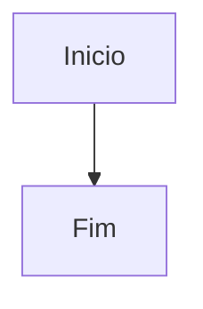

# Visualizador da documentacao UniNFe

Este diretorio contem um visualizador web estatico para os arquivos Markdown da pasta `docs`.

Ele nao usa backend, banco de dados ou framework de aplicacao. O navegador carrega os arquivos `.md` por `fetch()`, converte Markdown para HTML, sanitiza o conteudo gerado e renderiza blocos Mermaid.

## Arquivos

- `index.html`: pagina principal do visualizador.
- `app.js`: carregamento dos documentos, navegacao, busca, links internos, tema e Mermaid.
- `style.css`: layout responsivo e estilos de leitura.
- `build-docs-index.js`: script Node.js sem dependencias externas para gerar os indices.
- `docs-manifest.json`: lista de documentos usada no menu lateral.
- `search-index.json`: indice local usado pela pesquisa.

## Bibliotecas via CDN

O visualizador usa poucas bibliotecas conhecidas, carregadas por CDN em `index.html`:

- `marked`: conversao de Markdown para HTML no navegador.
- `DOMPurify`: sanitizacao do HTML gerado a partir do Markdown.
- `Mermaid`: renderizacao de blocos `mermaid`, incluindo `flowchart`.

## Atualizar o manifesto e o indice de busca

Sempre que arquivos `.md` forem criados, removidos ou renomeados dentro de `docs`, execute a partir da pasta `docs`:

```bash
node viewer/build-docs-index.js
```

O script percorre a pasta de documentacao, ignora `viewer`, `node_modules`, `.git`, arquivos ocultos, temporarios e arquivos que nao sejam `.md`, e recria:

- `viewer/docs-manifest.json`
- `viewer/search-index.json`

Ao final, ele informa no console quantos documentos foram indexados.

## Testar localmente

Abra a pasta `docs` em um servidor HTTP simples. Exemplo:

```bash
python -m http.server 8080
```

Depois acesse:

```text
http://localhost:8080/
```

Ao abrir sem informar um documento no hash da URL, o visualizador carrega `introducao/o-que-e-uninfe.md`.

Ao clicar em uma opção do menu, resultado de pesquisa ou link interno, o visualizador atualiza a URL com o parâmetro `doc`, permitindo compartilhar um link direto para a página aberta. Exemplo:

```text
http://localhost:8080/viewer/?doc=servicos/bpe/autorizacao-sincrona.md
```

Links antigos no formato `#/servicos/...` continuam sendo aceitos e são convertidos para o formato com `?doc=`.

Perguntas expansíveis do FAQ podem receber um identificador estável no atributo `id` do elemento `<details>`. Nesse caso, o fragmento da URL identifica a pergunta que deve ser aberta e exibida. Exemplo:

```text
http://localhost:8080/viewer/?doc=referencias/perguntas-frequentes.md#faq-dfe-parado-em-processamento
```

Ao abrir esse endereço, o visualizador expande a pergunta indicada. Ao clicar para abrir uma pergunta identificada, o fragmento correspondente também é colocado na URL, permitindo copiar o link diretamente do navegador.

Abrir `viewer/index.html` diretamente por `file:///` pode nao funcionar, porque navegadores costumam bloquear `fetch()` para arquivos locais.

## Publicar no site

Publique a pasta `docs` inteira preservando a estrutura de arquivos. O visualizador deve funcionar em uma URL como:

```text
https://www.unimake.com.br/uninfe/docs
```

O arquivo `docs/index.html` redireciona para `viewer/`, mantendo a URL publica mais curta. Os arquivos Markdown devem permanecer na pasta pai do `viewer` ou em subpastas de `docs`, pois o carregamento usa caminhos relativos.

## Mermaid

Blocos Markdown como este sao renderizados automaticamente:

````markdown

````

Se a sintaxe Mermaid tiver erro, o visualizador mostra uma mensagem amigavel e mantem o codigo original visivel para diagnostico.
